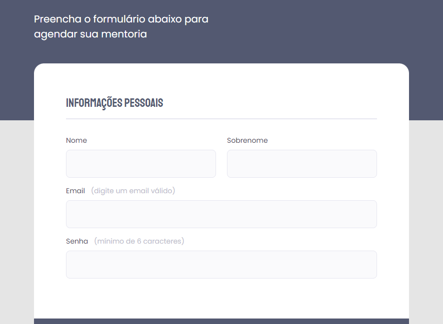

# Formulario2.0

=> Projeto Formulario, nova execução aplicando novos conceirtos

 

[Link de projeto](https://patyalvesena.github.io/Formulario2.0/)

## Análise de projeto.

 Layout disponível Figma [Aqui](https://www.figma.com/file/2uSbHYPkXCtg9sc5MpQm2R/Stage-03---Formul%C3%A1rio-intermedi%C3%A1rio-(Copy)?node-id=0%3A1)

Extrutura HTML
    Header - hero contendo Título e descrição.
    Main - fieldset agrupando campos relacionados.
    ->    Legend - input - label.
    Footer - Botão de submissão de formuário.
 
Fontes
    Conteúdos->  font-family: 'Poppins', sans-serif;
    Títulos>  font-family: 'Staatliches', cursive;

Cores do projeto:

Backgrounds:
    body: #e5e5e5;
    header: #535971;
    form: #ffffff;
    input: #fafafc; 
    button: #FF5374;

Fontes:
    header: #ffffff;
    legend: #535971;
    body: #4E4958;
    span: #C1BCCC;
